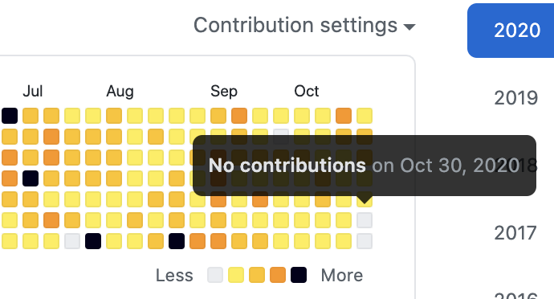
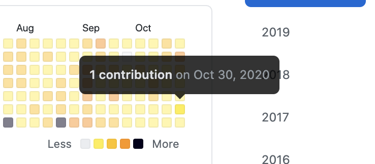

# timemachine-joke-20201031


## Repository Summary

This is just a repository for a quick experiment I had in mind.
I'm creating this to verify that modifying the commit time will also be reflected in GitHub's display.





I typed this command from this state.

```bash
GIT_COMMITTER_DATE="Fri Oct 30 12:30:27 2020 +0900" git commit --amend --date="Fri Oct 30 12:30:27 2020 +0900"
```

Then I pushed to remote.
I confirmed that the display has changed.
(This operate has being carried out on 2020/10/31.)

